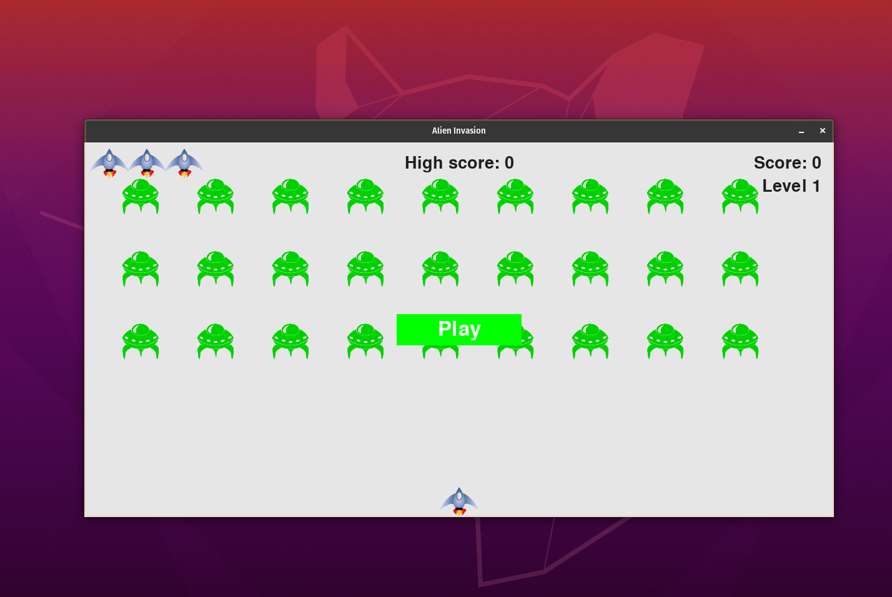

# Alien Invasion

O Alien Invasin é um jogo que permite que os jogadores sintam a experiência de eliminar alienigenas.

Projeto desenvolvido no pdf `Curso Intensivo de Python` de `Eric Mathes`.

## Pré-requisitos

Antes de começar, verifique se você atendeu aos seguintes requisitos:
* Você instalou python 3.
* Você tem uma máquina Windows/Linux/Mac.
* Você leu <a href="https://www.pygame.org/docs/">Documentção do Pygame</a>.

## Instalando Pygame

Para instalar o Pygame, siga estas etapas:

No terminal ou cmd digite:
```
pip install -r requirements.txt
```

## Jogando Alien Invasion

Para executar o jogo, siga estas etapas:
Linux e macOS:
```
python3 alien_invasion.pyw
```

Windows:
```
python alien_invasion.pyw
```

Na Invasão Alienígena, o jogador controla uma espaçonave que aparece na parte inferior central da tela. O jogador pode mover a espaçonave para a direita e para a esquerda usando as teclas de direção e atirar usando a barra de espaço. 

Quando o jogo começa, uma frota de alienígenas enche o céu e se desloca na tela para os lados e para baixo. O jogador atira nos alienígenas e os destrói. Se o jogador atingir todos os alienígenas, uma nova frota, que se moverá mais rapidamente que a frota anterior, aparecerá. Se algum alienígena atingir a espaçonave do jogador ou alcançar a parte inferior da tela, o jogador perderá uma nave. Se o jogador perder três espaçonaves, o jogo terminará.


## Colaboradores

Obrigado às seguintes pessoas que contribuíram para este projeto:

* [@sweydmanaf](https://github.com/sweydmanaf) 📖

## Contato

Se quiser entrar em contato comigo, você pode entrar em contato comigo em `abdulsweyd@gmail.com`.

## Licença
Este projeto usa a seguinte licença: [MIT License](https://opensource.org/licenses/MIT).
